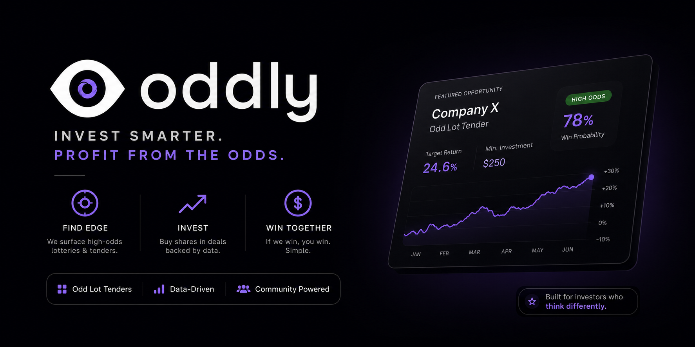

<p align="center">
  
</p>

# Oddly

Discover odd-lot tender offers before they close.

## What It Does

Oddly scans SEC EDGAR filings to find tender offers with odd-lot provisions. These are corporate buyback offers where shareholders holding 99 shares or fewer get priority acceptance at a fixed price. No proration. No partial fills.

You see something like this:

```
Symbol:         GBCS
Company:        Selectis Health Inc.
Filing:         SC TO-T (2026-07-15)

Tender Price:   $5.75
Market Price:   $5.30
Premium:        +8.5%

Max Shares:     99 (odd-lot)
Cost:           $524.70
Expected:       $44.55 profit

Verdict:        REJECTED — premium below 10% minimum
```

Most filings are rejected. The tool applies 11 verification gates. A filing either has an odd-lot provision or it does not. The premium is either above your threshold or it is not. No guessing.

## Why It Exists

SEC Rule 14d-10(f) allows tender offers to give priority to holders of 99 shares or fewer. A fund managing billions cannot use a 99-share allocation. The regulation was written to protect small shareholders. It accidentally created a structural asymmetry that only retail investors can act on.

Oddly automates the discovery. Claude Code provides the analysis. You make the decision.

## Claude Code Skill

Type `/oddly` to run the full pipeline. The skill checks your configuration, scans EDGAR, downloads each filing, applies all 11 gates, and presents a verdict with quotes from the filing text.

## Install

```bash
git clone https://github.com/KorroAi/oddly.git
cd oddly
pip install -e .
oddly setup
```

Python 3.10+. No API keys required.

## Commands

```
oddly scan          Scan EDGAR for tender offers and spin-offs
oddly setup         Configure capital and minimum premium
oddly portfolio     View positions and deadlines
oddly analyze SYM   Open the SEC filing for a ticker
oddly buy ...       Record a position
oddly sell ...      Close a position
```

## 11 Verification Gates

Gates are sequential. Any failure stops evaluation.

| Gate | Check |
|------|-------|
| G0 | Filing still active? |
| G1 | Odd-lot provision explicitly stated? |
| G2 | 100% cash consideration? |
| G3 | Affordable with 50% of capital? |
| G4 | Premium above 10%? |
| G5 | Deadline within 60 days? |
| G6 | NYSE or NASDAQ listed? |
| G7 | Two specific failure scenarios identified? |
| G8 | Tender price confirmed from filing text? |
| G9 | No red flags (insider selling, lawsuits)? |
| G10 | Explainable in two sentences? |

## Research Paper

[PAPER.pdf](PAPER.pdf) documents the regulatory basis, academic literature, methodology, and a 30-trade backtest of closed-end fund tender arbitrage (2024-2026). Also available as [Markdown](PAPER.md).

## Backtest

```bash
python -m oddly.backtest
```

30 trades, 27 with live yfinance data. Results saved to `oddly/.backtests/`.

## Files

```
oddly/
  oddly/
    sec_filings.py    EDGAR client, filing parser
    config.py          Configuration, portfolio tracking
    cli.py             Command-line interface
    backtest.py        Backtest engine
  SKILL.md             Claude Code skill
  PAPER.pdf            Research paper
```

## License

GNU AGPL-3.0. See [LICENSE](LICENSE). Personal use permitted. Commercial proprietary use prohibited.

## Links

[Discord](https://discord.gg/RSBHHjxnYt) · [X @korrocorp](https://x.com/korrocorp) · [GitHub](https://github.com/KorroAi) · [contact.korro@gmail.com](mailto:contact.korro@gmail.com)
